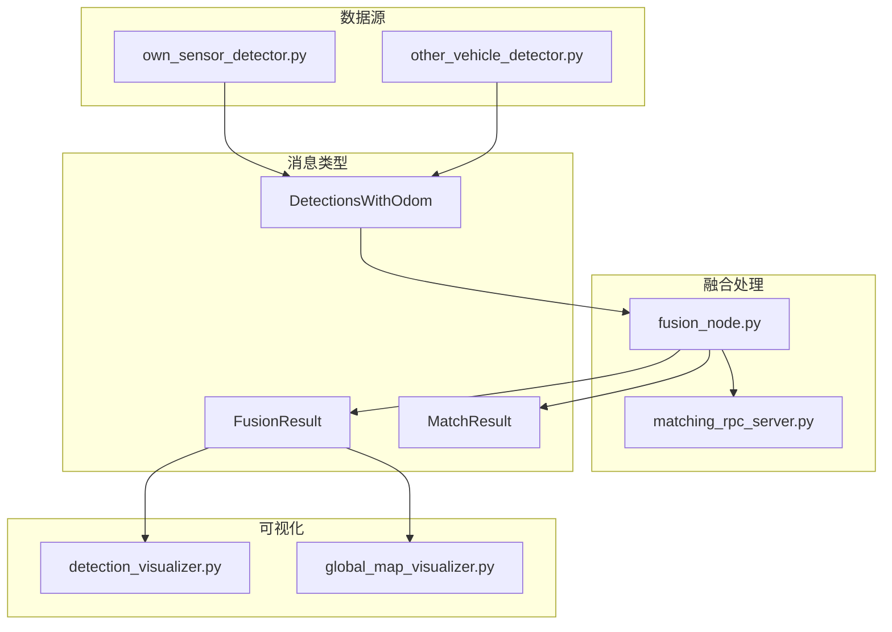
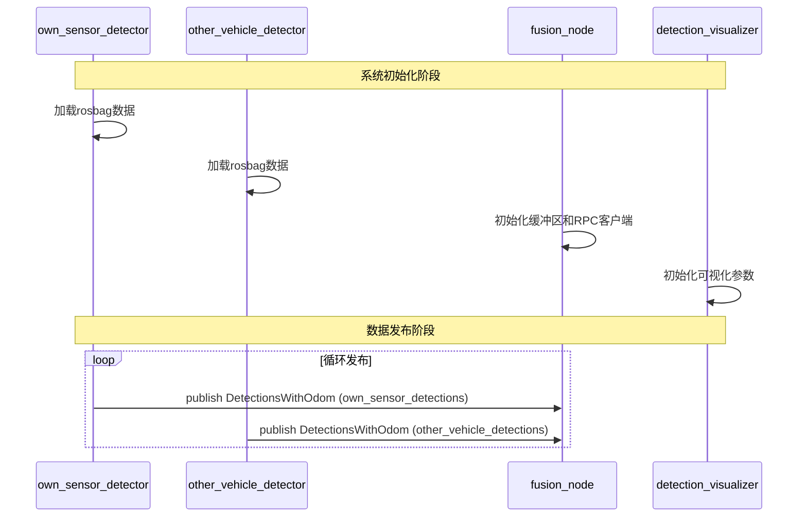
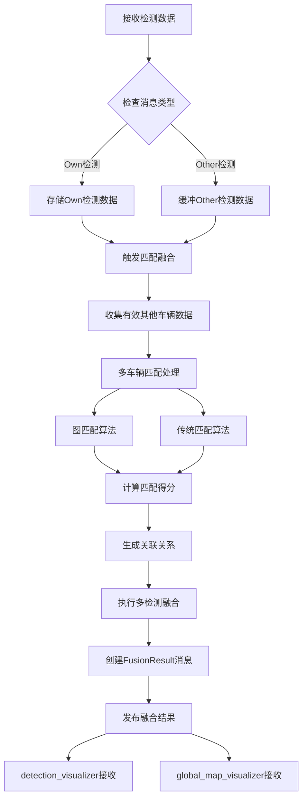
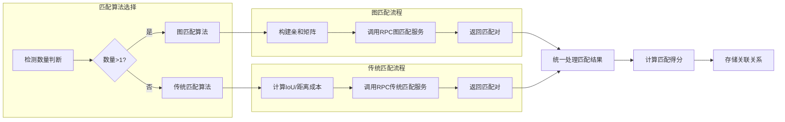
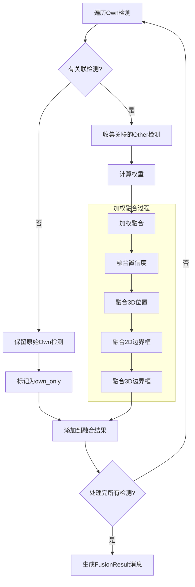
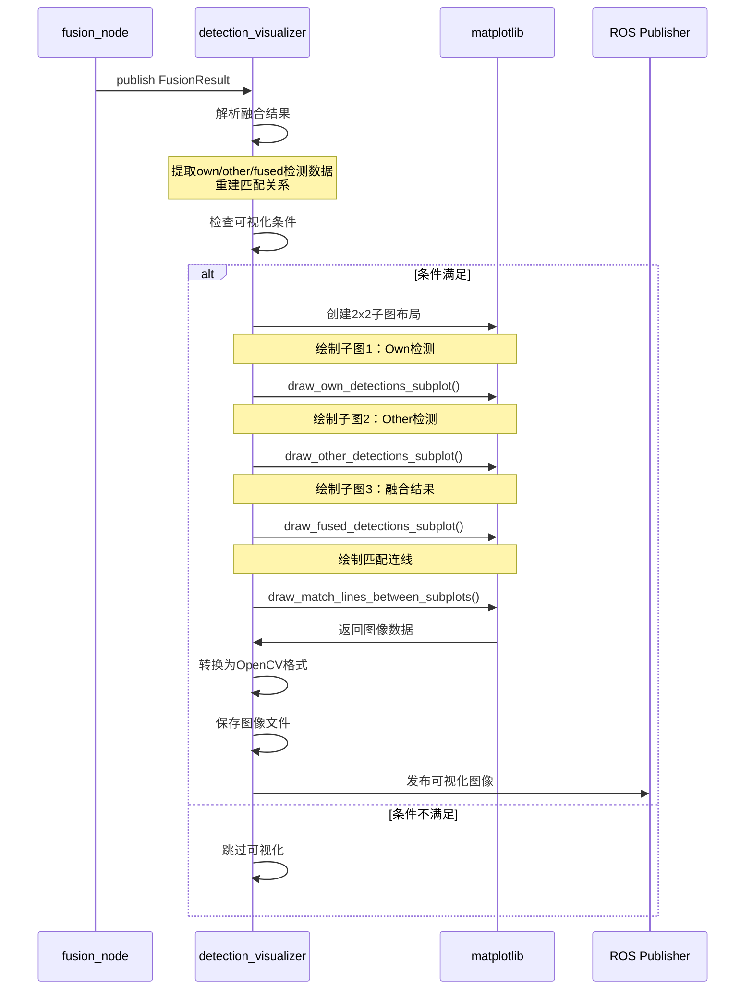
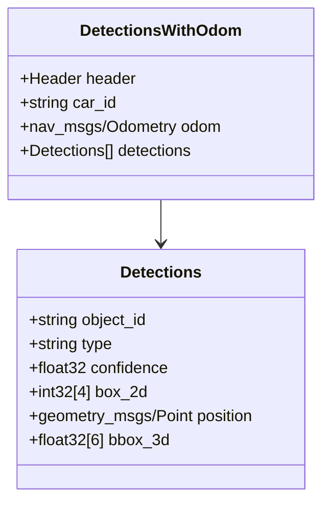
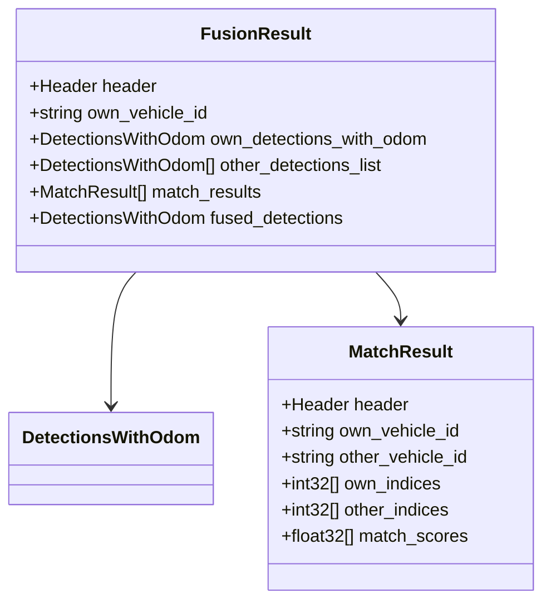
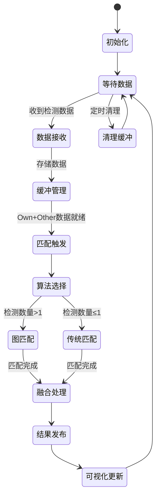
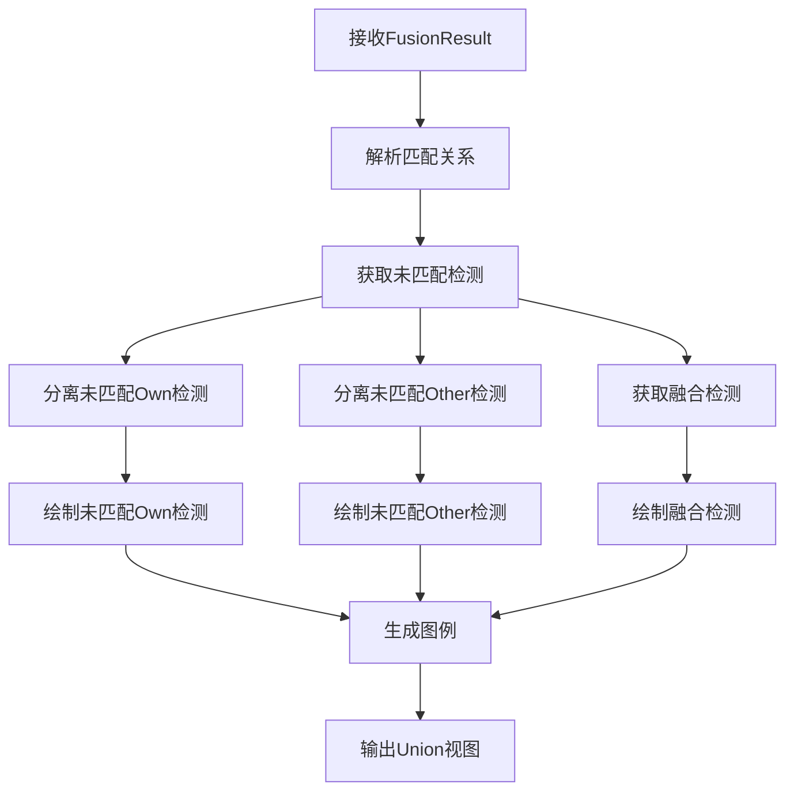

# 车辆检测融合系统流程文档

## 系统概述

车辆检测融合系统是一个基于ROS的多车协同感知系统，通过融合多个车辆的检测结果来提高整体感知精度。系统包含数据采集、目标匹配、信息融合和可视化等主要模块。

## 系统架构

## 详细流程图

### 1. 系统初始化和数据采集

### 2. 融合处理流程

### 3. 匹配算法详细流程

### 4. 融合算法流程

### 5. 可视化流程

## 消息数据结构

### 1. 基础检测消息

### 2. 融合结果消息

## 系统状态图

## 可视化模式

### Union Filtered模式流程

## 系统配置参数

| 参数名 | 默认值 | 说明 |
|--------|--------|------|
| `publish_rate` | 1.0 | 数据发布频率(Hz) |
| `figure_width` | 16 | 可视化图像宽度 |
| `figure_height` | 12 | 可视化图像高度 |
| `plot_range` | 50.0 | 绘图范围(米) |
| `subplot3_mode` | "union_filtered" | 子图3显示模式 |
| `require_fused_results` | true | 是否要求融合结果不为空 |
| `sync_timeout` | 5.0 | 同步超时时间(秒) |

## 关键特性

### 1. 多车协同感知
- 支持多个车辆的检测数据融合
- 时间同步机制确保数据一致性
- 自动管理车辆数据缓冲

### 2. 智能匹配算法
- 图匹配算法处理复杂场景
- 传统匹配算法处理简单场景
- RPC服务架构支持算法扩展

### 3. 灵活可视化
- 2x2子图布局清晰展示各阶段结果
- Union Filtered模式避免重复显示
- 实时连线显示匹配关系

### 4. 系统鲁棒性
- 超时机制防止系统阻塞
- 缓冲管理避免内存泄漏
- 错误处理保证系统稳定性

## 扩展性设计

系统采用模块化设计，支持以下扩展：

1. **新的匹配算法**：通过RPC服务接口添加
2. **多种数据源**：支持不同格式的检测数据
3. **可视化模式**：可添加新的显示模式
4. **全局地图**：支持多象限融合可视化

这种设计确保了系统的可维护性和可扩展性，为未来的功能增强奠定了良好基础。